# Kisan Setu — Data Flow Diagram (DFD) Architecture Documentation

**Product:** Kisan Setu — Intelligent Agricultural Procurement, Dynamic Queue Management & DBT Platform  
**Problem Statement:** SIH26032 (Smart India Hackathon 2026)  
**Standard Notation:** Gane-Sarson / Yourdon & Coad Diagrammatic Notation  
**Document Version:** 1.0.0  
**Status:** Approved Architectural Specification  

---

## Table of Contents

1. [Executive Summary & Purpose](#1-executive-summary--purpose)
2. [DFD Conventions, Symbols & Notations](#2-dfd-conventions-symbols--notations)
3. [External Entities & Boundary Interfacing Matrix](#3-external-entities--boundary-interfacing-matrix)
4. [DFD Level 0 — Context Diagram](#4-dfd-level-0--context-diagram)
5. [DFD Level 1 — Major Subsystem Decomposition](#5-dfd-level-1--major-subsystem-decomposition)
6. [DFD Level 2 — Detailed Sub-Process Flow Diagrams](#6-dfd-level-2--detailed-sub-process-flow-diagrams)
   - [6.1 Sub-Process 1.0: Farmer & Staff Authentication, Registration & KYC](#61-sub-process-10-farmer--staff-authentication-registration--kyc)
   - [6.2 Sub-Process 2.0: Centre Capacity, Slot Allocation & MSP Management](#62-sub-process-20-centre-capacity-slot-allocation--msp-management)
   - [6.3 Sub-Process 3.0: Slot Reservation & Digital Gate Pass Issuance](#63-sub-process-30-slot-reservation--digital-gate-pass-issuance)
   - [6.4 Sub-Process 4.0: Gate Pass QR Verification & Live Queue Orchestration](#64-sub-process-40-gate-pass-qr-verification--live-queue-orchestration)
   - [6.5 Sub-Process 5.0: Electronic Weighbridge & Tare/Gross Capture](#65-sub-process-50-electronic-weighbridge--taregross-capture)
   - [6.6 Sub-Process 6.0: Laboratory Quality Assessment & Grade Certification](#66-sub-process-60-laboratory-quality-assessment--grade-certification)
   - [6.7 Sub-Process 7.0: Procurement Finalization, Digital J-Form & DBT Payment](#67-sub-process-70-procurement-finalization-digital-j-form--dbt-payment)
   - [6.8 Sub-Process 8.0: AI/ML Queue Simulation & Wait-Time Prediction Engine](#68-sub-process-80-aiml-queue-simulation--wait-time-prediction-engine)
   - [6.9 Sub-Process 9.0: Grievance Redressal, Multi-Language & Notifications](#69-sub-process-90-grievance-redressal-multi-language--notifications)
   - [6.10 Sub-Process 10.0: Statewide Oversight, Cryptographic Audit & TEE Attestation](#610-sub-process-100-statewide-oversight-cryptographic-audit--tee-attestation)
7. [Data Store Directory (Schema Mapping)](#7-data-store-directory-schema-mapping)
8. [Data Dictionary & Payload Specifications](#8-data-dictionary--payload-specifications)
9. [Data Flow Security, Concurrency & Integrity Matrix](#9-data-flow-security-concurrency--integrity-matrix)

---

## 1. Executive Summary & Purpose

The **Kisan Setu** platform replaces archaic, opaque, and congestion-heavy traditional Mandi procurement procedures with an automated, cryptographically verifiable, and intelligent digital pipeline.

This **Data Flow Diagram (DFD)** document models the logical and physical movement of data throughout the Kisan Setu ecosystem. It defines:
- The data sources and destinations (**External Entities**).
- The business transformations and validations (**Processes**).
- The permanent and transient repositories (**Data Stores**).
- The directed conduits of information packets (**Data Flows**).

```text
+--------------------------------------------------------------------------------------------------+
|                                    CORE DATA VALUE PIPELINE                                      |
|                                                                                                  |
| [Farmer / Crop] ---> [Slot Booking] ---> [QR Gate Pass] ---> [Gate Check-In] ---> [Live Queue]   |
|                                                                                         |        |
| [DBT Direct Bank] <--- [J-Form Cert] <--- [MSP Procurement] <--- [Quality/Moisture] <--- [Scale] |
+--------------------------------------------------------------------------------------------------+
```

---

## 2. DFD Conventions, Symbols & Notations

In accordance with Gane-Sarson and Yourdon & Coad diagrammatic standards:

| Symbol / Element | Description | Visual Representation (Mermaid) |
| :--- | :--- | :--- |
| **External Entity** | An external person, system, or organization that sends or receives data. | `[Square Rectangles / Node]` |
| **Process** | A transformation, algorithm, calculation, or validation of data. | `(Rounded Rectangle / Process)` |
| **Data Store** | A persistent storage table, cache bucket, or transactional ledger. | `[(Cylinder Database Node / Table)]` |
| **Data Flow** | Directed arrow showing the name and direction of data transmission. | `-->|Data Flow Name|` |

---

## 3. External Entities & Boundary Interfacing Matrix

| Entity Code | Entity Name | Primary Responsibilities / Data Exchanged | Interfaces Used |
| :--- | :--- | :--- | :--- |
| **E1** | **Farmer** | Books slots, presents QR gate pass, monitors real-time queue position, reviews weighment & moisture slips, receives DBT payout alerts, submits grievances. | Mobile / Responsive Web App (8 Regional Languages: en, hi, mr, pa, bho, te, kn, ml) |
| **E2** | **Mandi Gate Operator / Staff** | Scans QR gate passes, verifies vehicle registration & slot time window, authorizes check-ins, operates weighbridge & quality stations. | Staff Web Portal / Handheld PWA Scanner |
| **E3** | **Centre Admin / Supervisor** | Configures daily slot quotas, assigns counters/bays, manages operator accounts, handles manual queue overrides and disputes. | Centre Admin Portal |
| **E4** | **State / Super Admin** | Regulates statewide MSP price masters, audits cryptographic tamper logs, tracks PFMS disbursement quotas, monitors statewide heatmaps. | Master Admin Portal |
| **E5** | **UIDAI / DigiLocker API** | Verifies farmer identity, Aadhaar tokenization, and digitizes certified land title ownership records (7/12, Khasra/Khatauni). | REST / HTTPS OAuth2 API |
| **E6** | **Electronic Weighbridge (IoT)** | Transmits raw gross vehicle weight and tare weight readings directly over serial/REST to prevent manual tampering. | RS232 / TCP-IP / Web-Serial IoT Bridge |
| **E7** | **PFMS / NPCI / RBI Gateway** | Executes Direct Benefit Transfer (DBT) disbursement directly to Aadhaar-seeded farmer bank accounts. | PFMS SFTP / ISO 20022 REST Webhooks |
| **E8** | **SMS / WhatsApp Gateway** | Delivers transactional OTPs, token QR cards, status transitions, and electronic J-Form download links. | Twilio / CDAC / WhatsApp Cloud API |
| **E9** | **IMD / Weather API** | Feeds live local atmospheric parameters (temperature, humidity, precipitation) for moisture adjustments & yard planning. | OpenWeatherMap / IMD Satellite REST API |
| **E10** | **TEE / Cryptographic Auditing Service** | Performs SHA-256 tamper-hash chaining on weighbridge tickets, J-Forms, and financial transaction ledger records. | Enclave RPC / Node Crypto Service |

---

## 4. DFD Level 0 — Context Diagram

The Level 0 diagram visualizes the high-level boundary of the entire **Kisan Setu Platform System (0.0)** with all connected external actors, hardware devices, and governmental gateways.

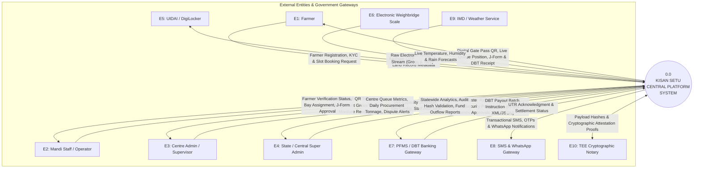

---

## 5. DFD Level 1 — Major Subsystem Decomposition

The Level 1 diagram breaks the platform into **10 core processing subsystems**, interacting with **14 distinct PostgreSQL / Redis data stores**.

```mermaid
flowchart TB
    %% External Entities
    E1["E1: Farmer"]
    E2["E2: Mandi Staff"]
    E3["E3: Centre Admin"]
    E4["E4: Super Admin"]
    E6["E6: Electronic Scale"]
    E7["E7: PFMS DBT Gateway"]
    E8["E8: SMS Gateway"]

    %% Data Stores
    D1[("D1: Users & Auth")]
    D2[("D2: Farmer Profiles & Land")]
    D3[("D3: Centres & Counters")]
    D4[("D4: Operating Hours & Slots")]
    D5[("D5: Appointments & Tokens")]
    D6[("D6: Live Yard Queue")]
    D7[("D7: Weighment Records")]
    D8[("D8: Quality Inspection Logs")]
    D9[("D9: Procurements & J-Forms")]
    D10[("D10: DBT Ledger & Vouchers")]
    D12[("D12: MSP Price Masters")]
    D13[("D13: Cryptographic Audit Trail")]
    D14[("D14: AI/ML Queue Dataset")]

    %% Processes
    P1("1.0<br/>Authentication &<br/>Profile Management")
    P2("2.0<br/>Centre Capacity &<br/>Slot Configuration")
    P3("3.0<br/>Slot Reservation &<br/>Gate Pass Generator")
    P4("4.0<br/>Gate Pass Verification<br/>& Queue Orchestrator")
    P5("5.0<br/>Electronic Scale<br/>Weighment Processing")
    P6("6.0<br/>Quality Assessment<br/>& Moisture Grading")
    P7("7.0<br/>Procurement Finalization<br/>& DBT Disbursement")
    P8("8.0<br/>AI Predictive Queue<br/>& Wait-Time Service")
    P9("9.0<br/>Notifications &<br/>Multi-Language I18N")
    P10("10.0<br/>Statewide Analytics<br/>& Cryptographic Audit")

    %% Subsystem 1 Connections
    E1 -->|"Phone, OTP, Aadhaar, Bank"| P1
    P1 <-->|"Read/Write User Credentials"| D1
    P1 <-->|"Store Farmer Details & KYC"| D2

    %% Subsystem 2 Connections
    E3 -->|"Define Centre Slots & Hours"| P2
    E4 -->|"Set MSP Rates per Crop"| P2
    P2 <-->|"Write Operating Capacities"| D3
    P2 <-->|"Generate Available Slot Matrix"| D4
    P2 <-->|"Update Government MSP Rates"| D12

    %% Subsystem 3 Connections
    E1 -->|"Select Centre, Crop, Date & Slot"| P3
    P3 <-->|"Validate Slot Availability"| D4
    P3 <-->|"Verify Farmer Eligibility"| D2
    P3 -->|"Create Confirmed Appointment"| D5
    P3 -->|"Trigger Token SMS/WhatsApp"| P9

    %% Subsystem 4 Connections
    E2 -->|"Scan Gate Pass QR / Token"| P4
    P4 <-->|"Verify Token & Date"| D5
    P4 -->|"Check-in Farmer & Assign Yard Seq"| D6
    P4 -->|"Push Live State Update"| P8
    P4 -->|"Emit Status Notification"| P9

    %% Subsystem 5 Connections
    E6 -->|"Raw Weight Signal"| P5
    E2 -->|"Gross & Tare Readings"| P5
    P5 <-->|"Fetch Queue Item"| D6
    P5 -->|"Store Net Weight Ticket"| D7

    %% Subsystem 6 Connections
    E2 -->|"Moisture %, Foreign Matter, Grade"| P6
    P6 <-->|"Fetch Weighment Ticket"| D7
    P6 -->|"Store Quality Certificate"| D8

    %% Subsystem 7 Connections
    P7 <-->|"Collate Weight, Quality & MSP"| D7
    P7 <-->|"Read Quality & Moisture"| D8
    P7 <-->|"Read Current MSP Price"| D12
    P7 -->|"Generate Certified J-Form"| D9
    P7 -->|"Create Payment Instruction"| D10
    P7 -->|"Dispatch PFMS DBT Transfer"| E7
    P7 -->|"Send Audit Record"| P10

    %% Subsystem 8 Connections
    D6 -->|"Live Queue Length & Wait Times"| P8
    P8 <-->|"Historical Wait Dataset"| D14
    P8 -->|"Dynamic Waiting Time & Rush ETA"| E1
    P8 -->|"Capacity Recommendations"| E3

    %% Subsystem 9 Connections
    P9 -->|"Transactional Alerts"| E8
    E8 -->|"SMS / WhatsApp"| E1

    %% Subsystem 10 Connections
    P10 <-->|"Tamper-evident SHA-256 Hashes"| D13
    P10 -->|"Statewide Analytics & Audits"| E4
```

---

## 6. DFD Level 2 — Detailed Sub-Process Flow Diagrams

---

### 6.1 Sub-Process 1.0: Farmer & Staff Authentication, Registration & KYC

Handles citizen and staff identification, OTP issuance, Aadhaar/DigiLocker KYC, and Role-Based Access Control (RBAC).

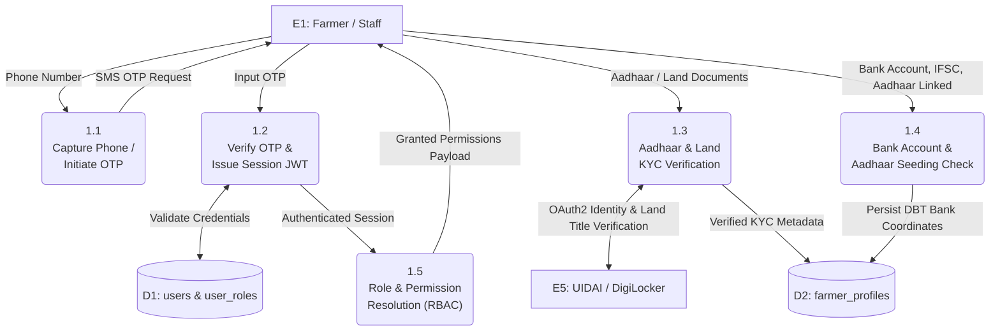

---

### 6.2 Sub-Process 2.0: Centre Capacity, Slot Allocation & MSP Management

Maintains procurement centres, operating hours, hourly capacity limits, crop seasons, and government MSP pricing.

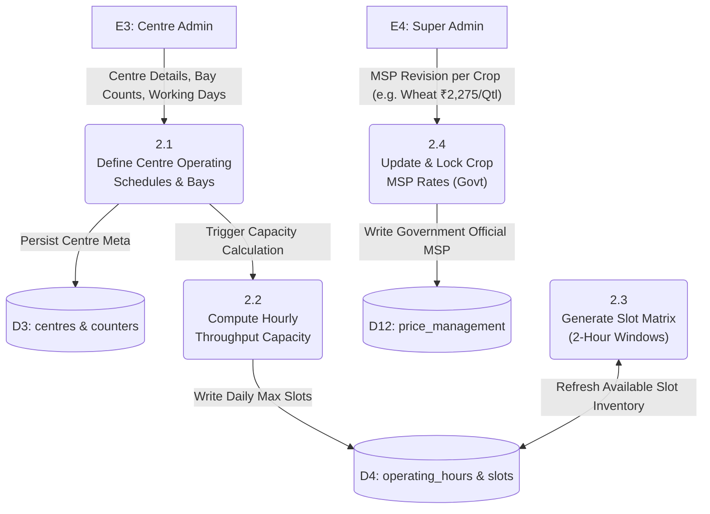

---

### 6.3 Sub-Process 3.0: Slot Reservation & Digital Gate Pass Issuance

Transforms a farmer's procurement intent into a confirmed appointment, allocates slot quotas, and generates a cryptographically signed digital gate pass with QR.

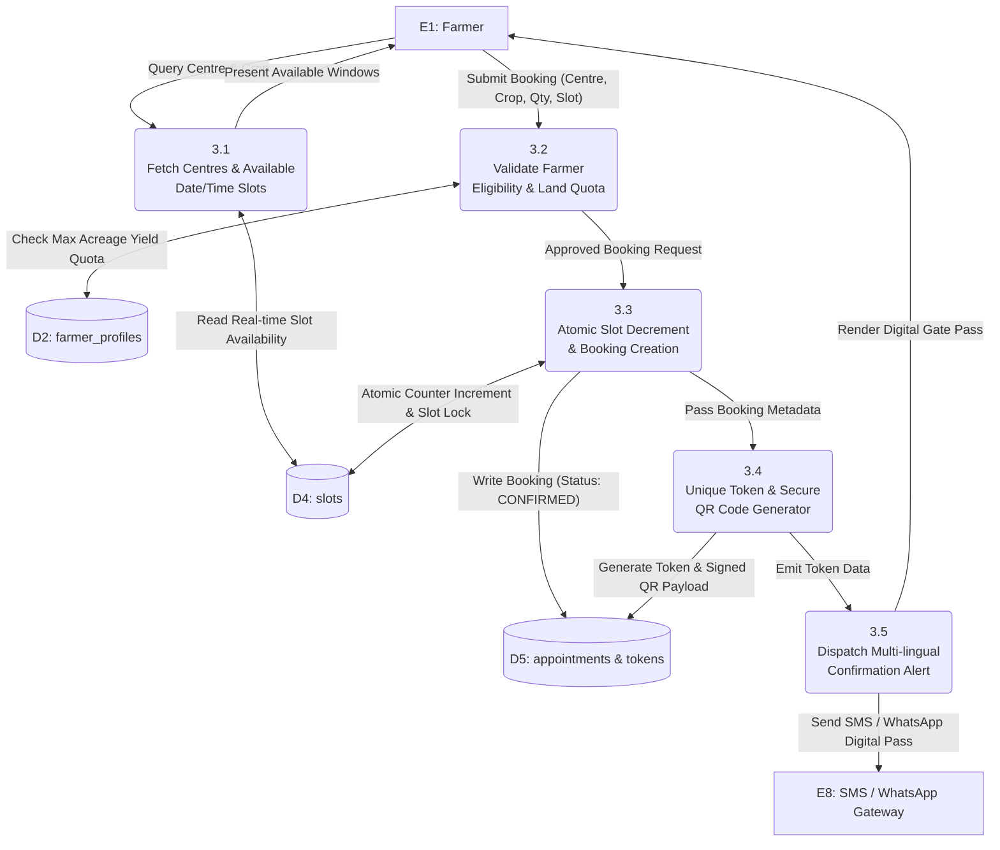

---

### 6.4 Sub-Process 4.0: Gate Pass QR Verification & Live Queue Orchestration

Enforces mandatory gate check-in so that only verified, present farmers enter the active yard queue.

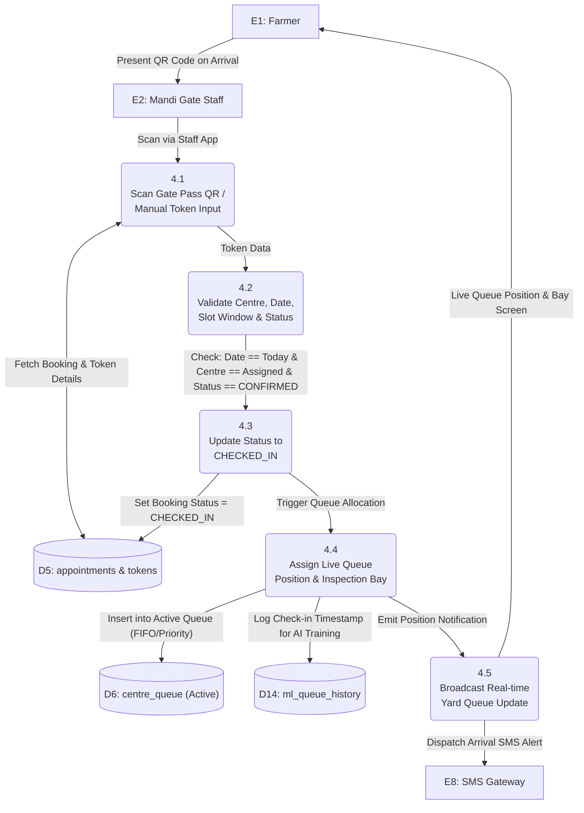

---

### 6.5 Sub-Process 5.0: Electronic Weighbridge & Tare/Gross Capture

Automates vehicle/produce weight capture with zero manual entry to prevent manipulation.

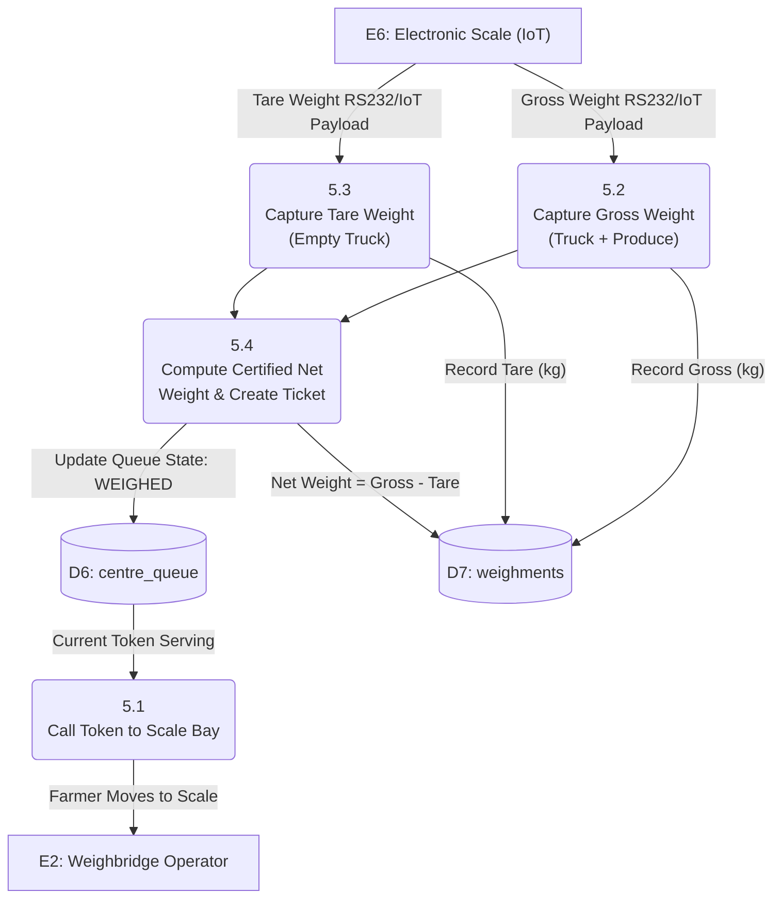

---

### 6.6 Sub-Process 6.0: Laboratory Quality Assessment & Grade Certification

Validates moisture percentage and impurities against FAQ (Fair Average Quality) government standards.

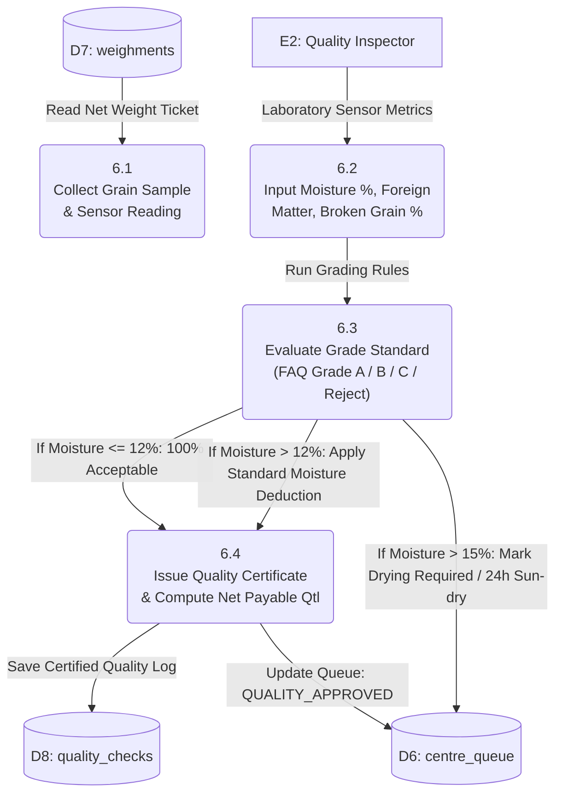

---

### 6.7 Sub-Process 7.0: Procurement Finalization, Digital J-Form & DBT Payment

Computes final payout based on Net Payable Quantity × Government MSP, generates authenticated J-Form certificates, and triggers PFMS Direct Benefit Transfer.

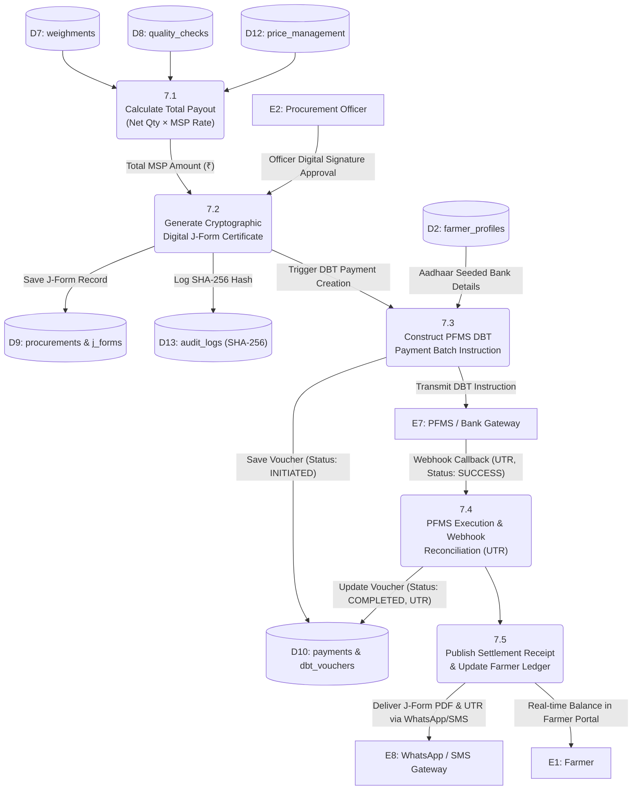

---

### 6.8 Sub-Process 8.0: AI/ML Queue Simulation & Wait-Time Prediction Engine

Uses Random Forest & Linear Regression models to continuously predict queue waiting times, counter wait estimates, and rush hour forecasts based on live yard data.

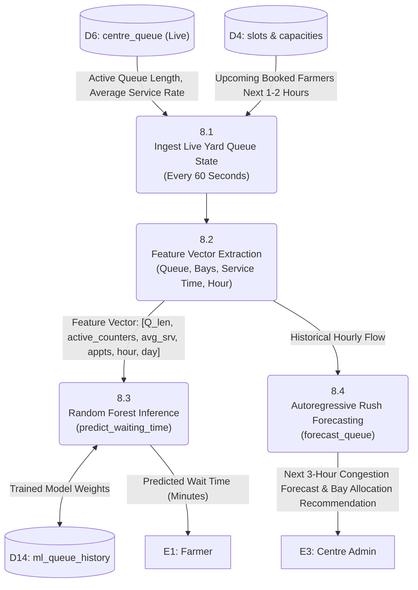

---

### 6.9 Sub-Process 9.0: Grievance Redressal, Multi-Language & Notifications

Delivers localization across 8 languages and handles automated dispute ticketing.

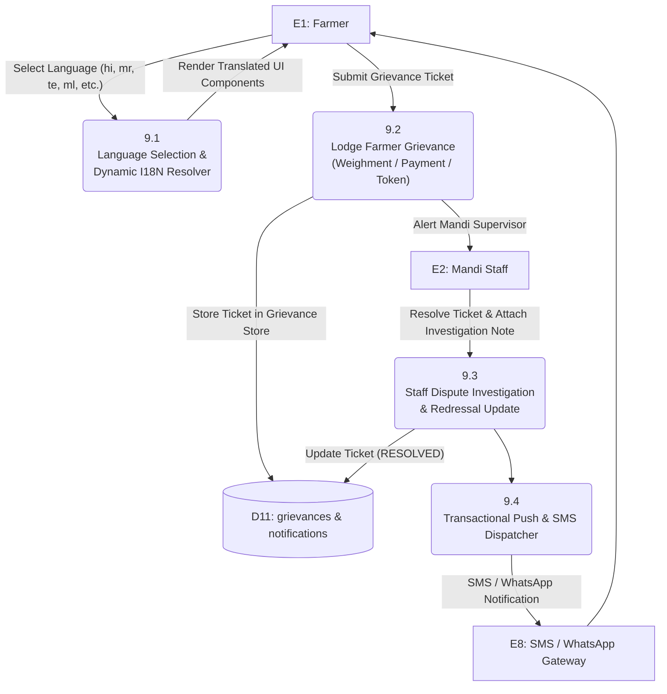

---

### 6.10 Sub-Process 10.0: Statewide Oversight, Cryptographic Audit & TEE Attestation

Maintains tamper-evident audit logs using SHA-256 cryptographic chaining.

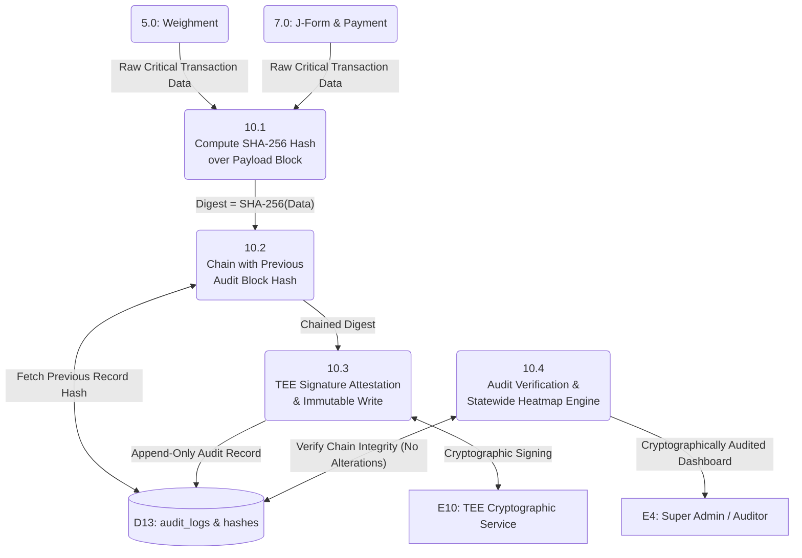

---

## 7. Data Store Directory (Schema Mapping)

The table below catalogs all primary data stores in the Kisan Setu ecosystem, mapping them to PostgreSQL relational tables and Redis caching layers.

| Store ID | Data Store Name | Type | Key Fields / Schema | Retention & Access Rules |
| :--- | :--- | :--- | :--- | :--- |
| **D1** | `users`, `user_roles`, `permissions` | PostgreSQL | `id`, `phone_number`, `password_hash`, `role` (FARMER, STAFF, CENTRE_ADMIN, ADMIN), `is_active`, `created_at` | Permanent; encrypted passwords (bcrypt); JWT auth sessions. |
| **D2** | `farmer_profiles`, `farmer_land_records` | PostgreSQL | `id`, `user_id`, `farmer_code`, `aadhaar_hash`, `bank_account_number`, `ifsc_code`, `land_area_acres`, `district`, `state` | Permanent; Aadhaar tokenized; bank details encrypted at rest. |
| **D3** | `centres`, `departments`, `counters` | PostgreSQL | `id`, `code`, `name`, `district`, `state`, `latitude`, `longitude`, `daily_capacity_quintals`, `active_bays` | Permanent; public readable for centre discovery. |
| **D4** | `operating_hours`, `slots` | PostgreSQL / Redis | `id`, `centre_id`, `date`, `start_time`, `end_time`, `max_capacity_quintals`, `booked_capacity_quintals`, `is_active` | Cached in Redis for sub-millisecond concurrency during booking bursts. |
| **D5** | `appointments`, `tokens` | PostgreSQL | `id`, `appointment_code`, `token_number`, `farmer_id`, `centre_id`, `slot_id`, `crop_type`, `estimated_quantity`, `status` (`CONFIRMED`, `CHECKED_IN`, `WEIGHED`, `COMPLETED`, `CANCELLED`), `qr_payload` | Permanent; indexed by `token_number`, `farmer_id`, and `date`. |
| **D6** | `centre_queue` / `live_yard_queue` | PostgreSQL / Redis | `id`, `centre_id`, `token_number`, `farmer_id`, `queue_position`, `bay_assigned`, `check_in_time`, `status` (`WAITING`, `WEIGHING`, `QUALITY_CHECK`, `DISPATCHED`) | Real-time Redis Sorted Set (`ZSET`) + PostgreSQL log for fault tolerance. |
| **D7** | `weighments` | PostgreSQL | `id`, `appointment_id`, `token_number`, `gross_weight_kg`, `tare_weight_kg`, `net_weight_kg`, `scale_operator_id`, `scale_device_id`, `gross_time`, `tare_time` | Immutable append-only log; IoT device signature verified. |
| **D8** | `quality_checks` | PostgreSQL | `id`, `appointment_id`, `token_number`, `moisture_percentage`, `foreign_matter_percentage`, `grade` (GRADE_A, GRADE_B, FAQ, REJECTED), `inspector_id`, `deduction_kg` | Permanent; attached to weighment ticket. |
| **D9** | `procurements`, `j_forms` | PostgreSQL | `id`, `j_form_number`, `appointment_id`, `farmer_id`, `centre_id`, `crop_type`, `final_procured_weight_quintals`, `msp_rate_per_quintal`, `gross_amount`, `j_form_pdf_url`, `approval_signature` | Legal audit record; digitally signed PDF generated. |
| **D10** | `payments`, `dbt_vouchers` | PostgreSQL | `id`, `procurement_id`, `farmer_id`, `amount_rupees`, `pfms_batch_id`, `utr_number`, `payment_status` (`INITIATED`, `PROCESSING`, `SUCCESS`, `FAILED`), `disbursed_at` | Financial ledger; append-only; reconciled via PFMS webhooks. |
| **D11** | `grievances`, `notifications` | PostgreSQL | `id`, `user_id`, `ticket_number`, `category`, `description`, `status` (`OPEN`, `INVESTIGATING`, `RESOLVED`), `assigned_to`, `resolution_notes` | Permanent; accessible to farmer and assigned supervisor. |
| **D12** | `price_management` (MSP Rates) | PostgreSQL | `id`, `crop_name`, `variety`, `msp_rate_per_quintal`, `season_year`, `effective_from`, `effective_to`, `is_active` | Versioned history of official government Minimum Support Prices. |
| **D13** | `audit_logs`, `tee_metadata` | PostgreSQL | `id`, `entity_type`, `entity_id`, `action`, `actor_id`, `prev_hash`, `curr_hash`, `payload_digest`, `created_at` | Append-only; SHA-256 cryptographic chain preventing retroactive tampering. |
| **D14** | `ml_queue_history`, `datasets` | PostgreSQL / Parquet | `id`, `centre_id`, `timestamp`, `queue_length`, `active_counters`, `avg_service_time`, `arrivals_count`, `served_count`, `actual_wait_minutes` | ML training feature store; used for offline model re-training. |

---

## 8. Data Dictionary & Payload Specifications

### 8.1 Data Flows Index

| Flow ID | Flow Name | Source | Destination | Data Composition / Fields |
| :--- | :--- | :--- | :--- | :--- |
| **F01** | `FarmerRegistrationReq` | E1 | P1 | `{ phone, name, aadhaarNo, state, district, bankAccount, ifsc, landAcres }` |
| **F02** | `SlotQuery` | E1 | P3 | `{ centreId, cropType, preferredDate }` |
| **F03** | `AvailableSlotMatrix` | P3 | E1 | `[{ slotId, startTime, endTime, availableCapacityQtl, status }]` |
| **F04** | `BookingSubmission` | E1 | P3 | `{ centreId, slotId, cropType, estQuantityQtl, vehicleType, vehicleNo }` |
| **F05** | `GatePassToken` | P3 | D5, E1, E8 | `{ tokenNo: "T-20260923-042", qrPayload: "KS:TOKEN:...", slotWindow: "10:00-12:00", centre: "Mandi A" }` |
| **F06** | `ScanQRCheckIn` | E2 | P4 | `{ qrPayload, staffId, centreId, checkInTimestamp }` |
| **F07** | `LiveQueueUpdate` | P4 | D6, E1 | `{ tokenNo, queuePosition: 4, farmersAhead: 3, estWaitMinutes: 22, bayAssigned: "BAY-02" }` |
| **F08** | `RawScaleSignal` | E6 | P5 | `{ deviceSerial: "WB-01", weightKg: 14250.0, timestamp, hash }` |
| **F09** | `WeighmentTicket` | P5 | D7, P6 | `{ tokenNo, grossWeightKg: 14250, tareWeightKg: 4200, netWeightKg: 10050 }` |
| **F10** | `QualityInspectionResult`| E2 | P6 | `{ tokenNo, moisturePct: 11.8, foreignMatterPct: 0.4, grade: "GRADE_A", deductionKg: 0 }` |
| **F11** | `JFormPayload` | P7 | D9, E1 | `{ jFormNo: "JF-2026-9812", netQtl: 100.5, mspRate: 2275.0, totalAmount: 228637.5, digitalSign }` |
| **F12** | `DBTInstruction` | P7 | E7 | `{ batchId: "DBT-20260923-01", aadhaarHash, ifsc, accountNo, amount: 228637.5, crop: "Wheat" }` |
| **F13** | `PFMSSettlementReport` | E7 | P7 | `{ batchId, utrNumber: "P260923987123", status: "SUCCESS", settledAt: "2026-09-23T10:45:00Z" }` |
| **F14** | `AIFeatureVector` | D6 | P8 | `{ queue_length: 12, active_counters: 4, avg_service_time: 8.5, appointments_next_hour: 15, hour: 10, day_of_week: 3 }` |
| **F15** | `AIWaitPrediction` | P8 | E1, E3 | `{ predicted_waiting_time_minutes: 25.5, status: "moderate_traffic", rush_alert: false }` |

---

## 9. Data Flow Security, Concurrency & Integrity Matrix

```text
+---------------------------------------------------------------------------------------------------+
| LAYER               SECURITY MECHANISM                   INTEGRITY ENFORCEMENT                    |
|---------------------------------------------------------------------------------------------------|
| Client / Transport  TLS 1.3 Strict HTTPS                 Token QR Signed with RS256 Private Key   |
| Authentication      JWT (HTTP-only) + RBAC               OTP expiry: 5 mins, max 3 attempts       |
| Concurrency (Slots) Redis Distributed Locks (Redlock)    PostgreSQL Row-level Locks (FOR UPDATE)  |
| Scale Hardware      RS232 / TCP Hardware Serial Port     Checksum validation on raw byte stream   |
| Financial / J-Form  SHA-256 Append-only Chaining         PFMS double-entry reconciliation ledger  |
| Auditing            TEE Attestation Metadata             Immutable write-once PostgreSQL table    |
+---------------------------------------------------------------------------------------------------+
```

1. **Concurrency Control during Booking Surges:**  
   When hundreds of farmers simultaneously request slots during seasonal peak windows, the system utilizes **Redis atomic decrement (`DECRBY`)** backed by **PostgreSQL row-level transactional locks (`SELECT FOR UPDATE`)** to prevent double-booking or quota overflows.

2. **Tamper-Proof Weighment Bridge:**  
   Raw weight captures bypass client-side form inputs and communicate directly through authenticated backend serial connectors, appending operator ID and device hardware UUID to the immutable weighment store (**D7**).

3. **Cryptographic J-Form & DBT Audit Trail:**  
   Every issued J-Form certificate and DBT voucher calculates a SHA-256 cryptographic hash over `{ appointmentId, farmerId, netWeight, mspRate, totalAmount, previousRecordHash }`, guaranteeing that no record can be modified retroactively without breaking the cryptographic audit chain.

---

*Document compiled and certified for Kisan Setu SIH Architecture Repository.*
